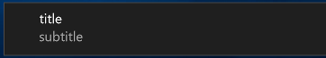
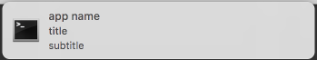
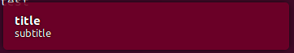

# Deprecated

This package is deprecated, please use [beeep](https://github.com/gen2brain/beeep) by @gen2brain instead!

# About

[](https://godoc.org/github.com/martinlindhe/notify)

Notify is a simple cross-platform library for displaying desktop notifications in your go application


## Example

```go
package main

import "github.com/martinlindhe/notify"

func main() {
	// show a notification
	notify.Notify("app name", "notice", "some text", "path/to/icon.png")

	// show a notification and play a alert sound
	notify.Alert("app name", "alert", "some text", "path/to/icon.png")
}
```


### Windows 10

Uses Toast notficiations provided by https://github.com/go-toast/toast




### macOS / OSX 10.8+

Uses terminal-notifier provided by https://github.com/deckarep/gosx-notifier




### Linux

Uses the notify-send and paplay commands,
both should be available on a default Ubuntu installation




### More

If you like this, check out https://github.com/martinlindhe/inputbox for cross-platform dialog input boxes.


### License

Under [MIT](LICENSE)
